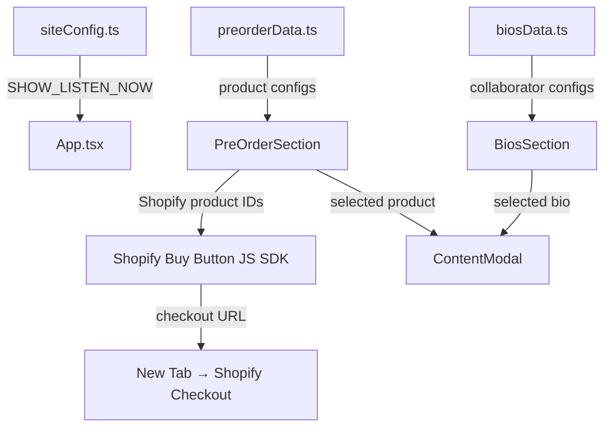

# Design Document: Stones River Revision

## Overview

This design describes the technical approach for revising the existing "Stones River" album promotional website. The revision restructures the single-page parallax scrolling experience by reordering sections, replacing the visual foundation with a cohesive blue background, adding new interactive components (bio cards with modals, product cards with Shopify integration), and refining the cinematic scroll experience — all without rebuilding from scratch.

The existing React/Vite/TypeScript/Tailwind CSS/shadcn-ui architecture is preserved. Changes are additive or refactoring-in-place: new components are created, existing components are modified, and the composition in App.tsx is updated.

### Key Design Decisions

1. **Global background via CSS custom property + `` preload** — The blue background asset is applied as a page-level background on the scrolling container rather than per-section, eliminating seams and simplifying maintenance.
2. **Shared modal component wrapping existing shadcn Dialog** — A single `ContentModal` component wraps the existing `@radix-ui/react-dialog`-based Dialog, accepting content via props. Both bio modals and product modals use this same component.
3. **Configuration flag as a TypeScript constant in a dedicated config file** — `SHOW_LISTEN_NOW` lives in `src/app/config/siteConfig.ts`, importable by App.tsx, changeable without touching component code.
4. **Shopify Buy Button JS loaded via script tag with a local data configuration layer** — Product data (IDs, descriptions, fallbacks) lives in a separate data file. The Shopify SDK is loaded lazily when the PreOrder section mounts.
5. **Embla Carousel (existing shadcn carousel) reused for Image Carousel** — No new carousel dependency; the existing `embla-carousel-react` integration with auto-play plugin handles the image slideshow.
6. **No new runtime dependencies** — All changes use libraries already in `package.json` (motion, embla-carousel-react, @radix-ui/react-dialog, lucide-react).

---

## Architecture

### Component Hierarchy (Post-Revision)

```
App.tsx
├── LandingPage (video background + "Enter" button)
│   └── [hasEntered = false gate]
└── ScrollContainer (hasEntered = true)
    ├── ImageCarouselSection (new, replaces HomeSection)
    ├── ListenNowSection (conditional on SHOW_LISTEN_NOW)
    ├── AboutSection (refactored AlbumBioSection)
    ├── BiosSection (new)
    │   ├── BioCard × 3
    │   └── ContentModal (shared)
    ├── PreOrderSection (refactored PreorderSection)
    │   ├── ProductCard × 7
    │   └── ContentModal (shared)
    ├── InterviewSection (refactored BehindTheMagicSection)
    └── Footer (new)
```

### Data Flow



### File Structure Changes

```
src/app/
├── config/
│   └── siteConfig.ts              # Configuration flags (SHOW_LISTEN_NOW)
├── data/
│   ├── preorderData.ts            # Preorder tier configurations
│   └── biosData.ts                # Collaborator bio configurations
├── components/
│   ├── App.tsx                    # Updated section order + conditional rendering
│   ├── LandingPage.tsx            # Modified: video background
│   ├── ImageCarouselSection.tsx   # New: replaces HomeSection
│   ├── AboutSection.tsx           # Refactored from AlbumBioSection
│   ├── BiosSection.tsx            # New: bio cards + modal
│   ├── PreOrderSection.tsx        # Refactored: vertical layout + Shopify
│   ├── InterviewSection.tsx       # Refactored from BehindTheMagicSection
│   ├── Footer.tsx                 # New
│   ├── ContentModal.tsx           # New: shared modal wrapper
│   ├── ListenNowSection.tsx       # Preserved (conditionally rendered)
│   ├── OrchestralTeaserSection.tsx # Removed from render order
│   ├── OrchestralLinkOutSection.tsx # Removed from render order
│   ├── HomeSection.tsx            # Preserved file, no longer rendered
│   └── ui/                        # Existing shadcn components (unchanged)
```

---

## Components and Interfaces

### 1. LandingPage (Modified)

```typescript
interface LandingPageProps {
  onEnter: () => void;
}
```

**Changes:**
- Replace the SVG noise placeholder with an HTML5 `<video>` element using `SR PAN2 1080p.mp4`
- Video attributes: `autoPlay`, `muted`, `loop`, `playsInline`, `object-fit: cover`
- Semi-transparent overlay div (opacity 0.4–0.5) between video and button for contrast
- Button text changed from "Experience Stones River" to "Enter"
- Fallback: `onError`/`onStalled` handler sets a state flag to show solid `#1a1a2e` background
- Transition on enter: fade-out animation (400ms) before `onEnter()` fires

### 2. ImageCarouselSection (New)

```typescript
interface ImageCarouselSectionProps {}
// No props — reads images from static imports
```

**Implementation:**
- Uses existing `Carousel`, `CarouselContent`, `CarouselItem`, `CarouselPrevious`, `CarouselNext` from `ui/carousel.tsx`
- Adds `embla-carousel-autoplay` plugin (already available via embla-carousel-react) for 5-second auto-advance
- Dot indicators rendered from Embla API's `scrollSnapList()`
- Pause on hover via Autoplay plugin's `stopOnInteraction` / mouse event handlers
- Images imported statically from `assets/Image Carousel Images/`
- Full viewport width on mobile, max-w-[1280px] centered on desktop
- Keyboard navigation already handled by existing carousel's `onKeyDownCapture`

### 3. AboutSection (Refactored from AlbumBioSection)

```typescript
interface AboutSectionProps {}
```

**Changes:**
- Remove the 2-column grid layout and image column
- Single centered text column: `max-w-[680px] mx-auto`
- Heading changed to "About Stones River"
- Preserve all existing bio copy verbatim
- Line-height: `leading-[1.8]`, paragraph spacing: `space-y-6`
- Remove `recordsImage` import

### 4. BiosSection (New)

```typescript
interface BioData {
  id: string;
  name: string;
  image: string;           // Asset path
  bioText: string;         // Full bio paragraph(s)
  websiteUrl: string;      // External link
  imageAlt: string;        // Accessible alt text
}
```

**Implementation:**
- Renders "Meet The Makers" heading
- 3 `BioCard` components in a responsive grid (`grid-cols-1 lg:grid-cols-3`)
- Each card: image + name text, hover scale/shadow effect
- Click opens `ContentModal` with bio content, image, globe icon link
- Data sourced from `biosData.ts`

### 5. ContentModal (New — Shared)

```typescript
interface ContentModalProps {
  open: boolean;
  onOpenChange: (open: boolean) => void;
  children: React.ReactNode;
  className?: string;
}
```

**Implementation:**
- Wraps existing shadcn `Dialog`, `DialogContent`, `DialogOverlay`
- Adds custom styling: dark background, fade+scale animation (200–300ms via existing Radix animation classes)
- Scroll lock handled by Radix Dialog (already prevents background scroll)
- Focus return handled by Radix Dialog (returns focus to trigger on close)
- Escape key close handled by Radix Dialog
- Click-outside close handled by Radix Dialog overlay
- Consuming components pass their own content layout as children

### 6. PreOrderSection (Refactored)

```typescript
interface ProductConfig {
  id: string;
  // Shopify product ID — to be provided by client
  shopifyProductId: string;
  // Shopify variant ID — to be provided by client
  shopifyVariantId: string;
  // Custom description displayed on the card (NOT Shopify HTML body)
  cardDescription: string;
  fallbackTitle: string;
  fallbackPrice: string;
  fallbackImage: string;
}
```

**Changes:**
- Remove horizontal scroll layout entirely
- Single-column vertical stack at all viewports
- Each `ProductCard` is full-width, landscape aspect ratio (flex row: image left, details right)
- Click opens `ContentModal` with full product details + "Purchase Now" button
- Shopify Buy Button JS loaded via `useEffect` script injection on mount
- Checkout URL generated via Shopify SDK; opens in new tab
- Fallback rendering when Shopify SDK unavailable: shows local data + inline note

### 7. InterviewSection (Refactored from BehindTheMagicSection)

```typescript
interface InterviewSectionProps {}
```

**Changes:**
- Remove "Behind the magic" heading text entirely
- Remove the `minHeight: 800px` constraint
- Preserve the staggered diagonal layout (desktop) and vertical stack (mobile)
- Preserve parallax transforms on video containers
- YouTube embed containers remain as placeholders with video icon + label

### 8. Footer (New)

```typescript
interface FooterProps {}
```

**Implementation:**
- OPO logo: `max-h-[48px]` with aspect ratio preserved
- Copyright text: "Nethermead Records © & ® 2025 The Orlando Philharmonic Orchestra. All Rights Reserved."
- Responsive: horizontal row on ≥768px, vertical stack on <768px
- Uses Blue_Background (inherits from page), text in light color for contrast
- Padding: `py-10` (40px)

### 9. App.tsx (Modified)

**Changes:**
- Import new/renamed components
- Import `SHOW_LISTEN_NOW` from config
- Apply blue background to the scroll container div
- Render sections in new order: ImageCarouselSection → (ListenNowSection if flag) → AboutSection → BiosSection → PreOrderSection → InterviewSection → Footer
- Remove OrchestralTeaserSection and OrchestralLinkOutSection from render (preserve files)

### 10. Global Background Strategy

**Implementation:**
- The scrolling container `<div>` in App.tsx gets:
  ```tsx
  style={{
    backgroundImage: `url(${blueBgImage})`,
    backgroundSize: 'cover',
    backgroundPosition: 'center',
    backgroundAttachment: 'scroll',
    backgroundColor: '#0d1b2a' // fallback navy
  }}
  ```
- Individual section `backgroundColor` inline styles are removed
- Sections that need contrast overlays add their own semi-transparent layer
- The `` is preloaded via `<link rel="preload">` in index.html for fast paint

---

## Data Models

### Site Configuration (`src/app/config/siteConfig.ts`)

```typescript
export const siteConfig = {
  /** Controls visibility of the Listen Now DSP links section.
   *  Set to true when streaming platform links are ready. */
  SHOW_LISTEN_NOW: false,
} as const;
```

### Preorder Data (`src/app/data/preorderData.ts`)

```typescript
export interface ProductConfig {
  id: string;
  /** Shopify product ID — replace with actual ID from Shopify admin */
  shopifyProductId: string;
  /** Shopify variant ID — replace with actual variant ID from Shopify admin */
  shopifyVariantId: string;
  /** Custom description shown on the product card (not Shopify HTML body) */
  cardDescription: string;
  fallbackTitle: string;
  fallbackPrice: string;
  /** Path to fallback image asset when Shopify data unavailable */
  fallbackImage: string;
}

export const preorderProducts: ProductConfig[] = [
  {
    id: 'tier-1',
    shopifyProductId: '', // TODO: Replace with Shopify product ID from admin
    shopifyVariantId: '', // TODO: Replace with Shopify variant ID from admin
    cardDescription: 'Digital download of the complete Stones River album.',
    fallbackTitle: 'Tier 1 — Digital Album',
    fallbackPrice: '$XX.XX',
    fallbackImage: '/assets/placeholder-product.png',
  },
  // ... tiers 2–7 follow same structure
];
```

### Bios Data (`src/app/data/biosData.ts`)

```typescript
export interface BioData {
  id: string;
  name: string;
  /** Path to bio image asset */
  image: string;
  /** Accessible alt text for the image */
  imageAlt: string;
  /** Full bio text — replace placeholder with final copy */
  bioText: string;
  /** External website URL, opens in new tab */
  websiteUrl: string;
}

export const collaborators: BioData[] = [
  {
    id: 'jeremy-kittel',
    name: 'Jeremy Kittel',
    image: '/assets/Bio Images/Jeremy Kittel Bio Image.tif',
    imageAlt: 'Jeremy Kittel portrait',
    // TODO: Replace with final bio text from client
    bioText: '[Placeholder: Jeremy Kittel bio text to be provided]',
    websiteUrl: 'https://jeremykittel.com/',
  },
  {
    id: 'eric-jacobsen',
    name: 'Eric Jacobsen',
    image: '/assets/Bio Images/Eric Jacobsen Bio Image.png',
    imageAlt: 'Eric Jacobsen portrait',
    // TODO: Replace with final bio text from client
    bioText: '[Placeholder: Eric Jacobsen bio text to be provided]',
    websiteUrl: 'https://www.jacobseneric.com/',
  },
  {
    id: 'orlando-philharmonic',
    name: 'The Orlando Philharmonic Orchestra',
    image: '/assets/Bio Images/Orlando Philharmonic Orchestra Bio Image.jpg',
    imageAlt: 'The Orlando Philharmonic Orchestra',
    // TODO: Replace with final bio text from client
    bioText: '[Placeholder: Orlando Philharmonic Orchestra bio text to be provided]',
    websiteUrl: 'https://orlandophil.org/',
  },
];
```

### Shopify Integration Configuration

The Shopify Buy Button JS SDK is loaded dynamically:

```typescript
// Loaded in PreOrderSection useEffect
interface ShopifyConfig {
  /** Shopify store domain — replace with actual store domain */
  domain: string;
  /** Shopify Storefront Access Token — replace with actual token */
  storefrontAccessToken: string;
}

// TODO: Replace with actual Shopify credentials from store admin
export const shopifyConfig: ShopifyConfig = {
  domain: '', // e.g., 'your-store.myshopify.com'
  storefrontAccessToken: '', // Storefront API access token
};
```

### Asset Organization

```
assets/
├── Bio Images/
│   ├── Jeremy Kittel Bio Image.tif
│   ├── Eric Jacobsen Bio Image.png
│   └── Orlando Philharmonic Orchestra Bio Image.jpg
├── Image Carousel Images/
│   ├── Image Carousel 1.jpg
│   ├── Image Carousel 2.jpg
│   ├── Image Carousel 3.jpg
│   ├── Image Carousel 4.jpg
│   └── Image Carousel 5.jpg
├── Kittel BLUE BG.png
├── Orlando Philharmonic Orchestra Logo.jpeg
├── SR PAN2 1080p.mp4
└── Vinyl_Front_And_Back.png
```

All asset references use paths relative to the `assets/` directory. Replacing an asset requires only swapping the file at its known location.

---

## Correctness Properties

*A property is a characteristic or behavior that should hold true across all valid executions of a system — essentially, a formal statement about what the system should do. Properties serve as the bridge between human-readable specifications and machine-verifiable correctness guarantees.*

### Property 1: Bio modal renders all required fields

*For any* valid BioData object (with non-empty name, image path, bioText, websiteUrl, and imageAlt), rendering the bio modal with that data SHALL produce DOM containing: the collaborator's name as visible text, an image element with the correct src and alt, the bio text content, and a globe icon element linking to the websiteUrl.

**Validates: Requirements 7.2**

### Property 2: Product card renders required Shopify data

*For any* valid ProductConfig where Shopify data is available (non-empty shopifyProductId and simulated Shopify response), rendering the product card SHALL produce DOM containing: a product image, the product price, the product name, and the custom local cardDescription text.

**Validates: Requirements 8.5**

### Property 3: Product modal renders all required fields

*For any* valid ProductConfig with available Shopify data, rendering the product modal SHALL produce DOM containing: the product image, product name, product price, the Shopify product description, and a "Purchase Now" button element.

**Validates: Requirements 9.2**

### Property 4: Product configuration data structure completeness

*For any* entry in the preorderProducts array, the entry SHALL contain all required fields with defined values: a non-empty id string, a shopifyProductId string (may be empty placeholder), a shopifyVariantId string (may be empty placeholder), a non-empty cardDescription string, a non-empty fallbackTitle string, a non-empty fallbackPrice string, and a non-empty fallbackImage string.

**Validates: Requirements 9.7**

### Property 5: Section render order invariant

*For any* boolean value of the SHOW_LISTEN_NOW configuration flag, the rendered section order SHALL match the specification: ImageCarouselSection first, then ListenNowSection (only when flag is true), then AboutSection, BiosSection, PreOrderSection, InterviewSection, and Footer last — with no sections appearing out of order or duplicated.

**Validates: Requirements 12.1**

### Property 6: Asset placeholder rendering

*For any* asset reference that fails to load (image src returning error), the rendered placeholder SHALL contain: a container element with a visible border or distinct background color, a generic image icon element, and a text label containing the expected filename of the missing asset.

**Validates: Requirements 15.1**

---

## Error Handling

### Video Load Failure (Landing Page)
- **Detection:** `onError` and `onStalled` events on the `<video>` element, plus a 10-second timeout via `setTimeout`
- **Response:** Set component state `videoFailed = true`, which swaps the video for a solid `#1a1a2e` (dark navy) background
- **User impact:** The "Enter" button remains fully functional; only the background changes

### Blue Background Asset Failure
- **Detection:** CSS `background-image` with `background-color: #0d1b2a` as fallback — browsers automatically show the fallback color when the image fails
- **Response:** No JavaScript needed; pure CSS fallback
- **User impact:** Seamless — user sees a solid navy instead of the textured blue

### Image Load Failures (Carousel, Bios, Products)
- **Detection:** `onError` handler on each `` element sets a local `loadFailed` state
- **Response:** Render a placeholder `<div>` with border, image icon (from lucide-react), and filename text
- **User impact:** Clear indication of what's missing; layout remains stable

### Shopify SDK Initialization Failure
- **Detection:** `try/catch` around `ShopifyBuy.buildClient()` call; timeout after 15 seconds
- **Response:** Set `shopifyAvailable = false` state; render fallback product data from local config; show inline note "Shopify integration pending — configure credentials in shopifyConfig"
- **User impact:** Can browse products but cannot purchase; clear developer-facing message

### Shopify Checkout URL Generation Failure
- **Detection:** `try/catch` around checkout creation; handle rejected promises from SDK
- **Response:** Display error message in modal: "Purchase temporarily unavailable. Please try again later."; disable "Purchase Now" button
- **User impact:** Cannot complete purchase but can still browse

### Component Render Failure
- **Detection:** React Error Boundary wrapping each section in App.tsx
- **Response:** Failed section is hidden; remaining sections render in correct order
- **User impact:** Partial page degradation rather than full crash

---

## Testing Strategy

### Unit Tests (Example-Based)

Unit tests cover specific scenarios, edge cases, and concrete behavior:

- **LandingPage:** Video attributes (muted, autoPlay, loop, playsInline), "Enter" button text, overlay opacity, fallback on video error
- **ImageCarouselSection:** Correct number of slides, navigation arrows present, dot indicators, keyboard navigation, auto-advance timing
- **AboutSection:** Heading text "About Stones River", no image column, bio copy verbatim, typography constraints
- **BiosSection:** Three cards with correct names, hover effects, responsive grid/stack layout
- **PreOrderSection:** Seven product cards, vertical layout, no horizontal scroll, heading text
- **InterviewSection:** No heading text, two video containers, staggered layout on desktop
- **Footer:** Logo sizing, exact copyright text, responsive layout
- **ContentModal:** Close button, escape key, click-outside, focus return, scroll lock
- **Configuration flag:** Section visibility toggling, no DOM residue when hidden

### Property-Based Tests

Property tests verify universal properties across generated inputs. Using `fast-check` (already compatible with the Vite/TypeScript toolchain via vitest).

**Configuration:**
- Minimum 100 iterations per property test
- Each test tagged with: `Feature: stones-river-revision, Property {N}: {title}`

**Properties to implement:**
1. Bio modal field completeness (generate random valid BioData objects)
2. Product card field rendering (generate random valid ProductConfig objects with mock Shopify data)
3. Product modal field rendering (generate random valid ProductConfig objects)
4. Product configuration schema validation (validate all entries in preorderProducts)
5. Section order invariant (generate random boolean flag values)
6. Asset placeholder rendering (generate random asset paths that fail to load)

### Integration Tests

- Shopify SDK loading and client initialization (mocked)
- Checkout URL generation flow (mocked Shopify responses)
- Full page scroll behavior with parallax transforms
- Video playback lifecycle on LandingPage

### Visual/Accessibility Tests

- Lighthouse accessibility audit for WCAG AA contrast
- Responsive layout verification at 320px, 768px, 1024px, 1440px, 2560px
- No horizontal overflow at any viewport width
- Minimum tap target sizes on mobile

### Test Framework

- **Runner:** Vitest (compatible with existing Vite setup)
- **Component testing:** @testing-library/react
- **Property-based testing:** fast-check
- **Accessibility:** axe-core via @axe-core/react or vitest-axe

