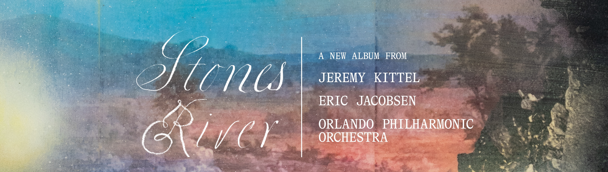

# Stones River — Website Header (Banner + Navigation)

A drop-in website header: the **Stones River** album banner with a **frosted-glass
navigation bar** floating on the top strip. The banner artwork is never altered —
the nav is real, clickable HTML overlaid on it, and it's fully responsive
(collapses to a hamburger menu on phones).

Built with the **Fira Sans** font (self-hosted) and plain HTML/CSS + ~8 lines of JS.
No frameworks, no build step.

---

## What's in this bundle

```
Stones River Header Bundle/
├── index.html                 ← working demo / reference implementation
├── stones-river-header.css    ← the component styles (the real deliverable)
├── assets/
│   ├── stones-river-banner.webp       (3840px, primary)
│   ├── stones-river-banner-1920.webp  (1920px, phones/tablets via srcset)
│   ├── stones-river-banner.jpg        (3840px, fallback for old browsers)
│   └── fonts/
│       ├── FiraSans-Regular.woff2     (400)
│       ├── FiraSans-Medium.woff2      (500)
│       └── FiraSans-SemiBold.woff2    (600)
├── source/
│   └── stones-river-banner-source.png (full-res original, for future edits)
└── previews/                  ← reference screenshots (not used by the site)
```

Open `index.html` in a browser to see the finished header.

---

## Quick integration (3 steps)

1. **Copy the files into the project**
   - `stones-river-header.css` → your styles folder
   - everything in `assets/` (the 3 banner files + `fonts/`) → your assets folder,
     keeping the relative path `assets/fonts/...` **or** update the `url(...)` and
     `src`/`srcset` paths to match your structure.

2. **Link the stylesheet** in your page `<head>`:
   ```html
   <link rel="stylesheet" href="/path/to/stones-river-header.css" />
   ```

3. **Paste the header markup** as the first thing inside `<body>` (snippet below),
   and include the small toggle script (also below). Point the six `href`s at your
   real routes.

That's it. The header is full-bleed (edge-to-edge) by default.

---

## Header markup (copy/paste)

```html
<header class="sr-header">
  <picture>
    <source type="image/webp"
            srcset="assets/stones-river-banner-1920.webp 1920w,
                    assets/stones-river-banner.webp 3840w"
            sizes="100vw" />
    
  </picture>

  <nav class="sr-nav" aria-label="Primary" data-open="false">
    <button class="sr-nav__toggle" type="button"
            aria-expanded="false" aria-controls="sr-menu" aria-label="Toggle navigation menu">
      <span></span>
    </button>

    <ul class="sr-nav__links" id="sr-menu">
      <li><a class="sr-nav__link" href="/">Home</a></li>
      <li><a class="sr-nav__link" href="/about">About</a></li>
      <li><a class="sr-nav__link" href="/experience">Experience</a></li>
      <li><a class="sr-nav__link" href="/makers">The Makers</a></li>
      <li><a class="sr-nav__link" href="/gallery">Gallery</a></li>
      <li><a class="sr-nav__cta" href="/preorder">Preorder</a></li>
    </ul>
  </nav>
</header>
```

## Mobile-menu toggle script (copy/paste, near end of `<body>`)

```html
<script>
  (function () {
    var nav = document.querySelector('.sr-nav');
    var btn = nav.querySelector('.sr-nav__toggle');
    btn.addEventListener('click', function () {
      var open = nav.getAttribute('data-open') === 'true';
      nav.setAttribute('data-open', String(!open));
      btn.setAttribute('aria-expanded', String(!open));
    });
  })();
</script>
```

> If the site is React/Vue/etc., replace the script with the framework equivalent:
> toggle the `data-open` attribute (and `aria-expanded`) between `"true"`/`"false"`
> on click. The CSS does the rest.

---

## Customizing (all knobs live at the top of the CSS, in `:root`)

| Variable | Does what | Default |
|---|---|---|
| `--sr-banner-ratio` | **Must match the banner's pixel dimensions.** | `3840 / 1093` |
| `--sr-header-max-width` | `none` = full-bleed. Set a px value (e.g. `1400px`) to cap + center it. | `none` |
| `--sr-link-color` / `--sr-link-color-hover` | Nav link text colors | white |
| `--sr-cta-bg-hover` / `--sr-cta-color-hover` | Pre-Order button hover fill / text | white / dusk-blue |
| `--sr-glass-blur`, `--sr-glass-bg`, `--sr-glass-border` | Frosted-bar look | — |
| `--sr-link-tracking` | Letter-spacing on the nav text | `0.14em` |

**Nav bar height** is the vertical padding on `.sr-nav`
(`padding: clamp(0.12rem, 0.4vw, 0.3rem) ...`). Increase the first value to make the
bar taller, decrease to make it shorter. (Current value is tuned to clear the
white text on the artwork.)

**Swapping the banner later:** drop in a new image at the same `assets/` paths and
update `--sr-banner-ratio` to the new `width / height`. Keep the artwork wide & short
(~3.5:1) with a calm band of sky across the top for the nav to sit in.

---

## Notes

- **Colors** are all CSS custom properties (no hardcoded hex in rules) — easy to theme.
- **Accessibility:** real `<a>`/`<button>` elements, `aria-*` on the toggle,
  `:focus-visible` styles, and `prefers-reduced-motion` support.
- **Browser support:** WebP + `backdrop-filter` are supported in all current
  browsers (Chrome, Edge, Safari 14+, Firefox). The JPG fallback covers anything
  that can't do WebP. If `backdrop-filter` is unavailable, the bar still shows a
  soft translucent white (just without the blur).
- The class prefix `sr-` is namespaced to avoid colliding with existing site styles.
